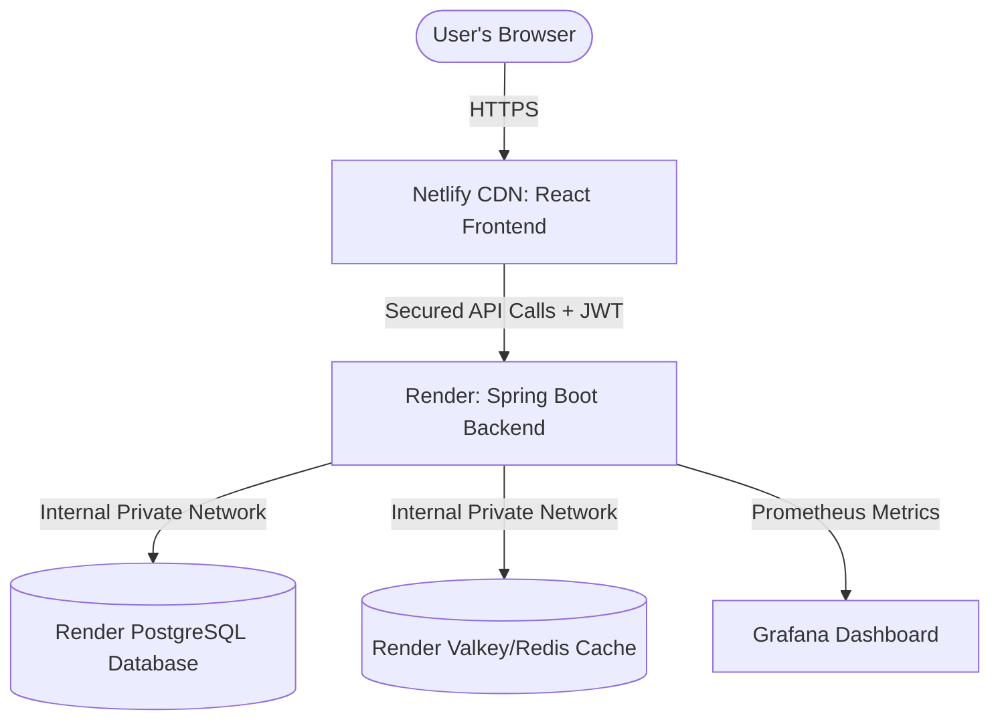

#  TransitConnect

**Find the routes locals actually take.**

TransitConnect is a community-driven, full-stack web application designed to help users discover and share local transit routes. Unlike generic mapping services, TransitConnect focuses on the "hidden" connections that locals know and use daily—capturing a network of transit stops and connections reported by the community itself.

##  🚀 Live Demo

*   **Frontend (React App):** [https://transitfrontend.netlify.app](https://transitfrontend.netlify.app)
*   **Backend API Service:** [https://transitconnect.onrender.com](https://transitconnect.onrender.com)
*   **Production API Health Check:** [https://transitconnect.onrender.com/actuator/health](https://transitconnect.onrender.com/actuator/health)

*Note: The backend is hosted on a free tier, so the first request may take a few seconds to "wake up" the server.*

---

##  📐 Production Architecture



---

##  The "Best Suit" Advantage

TransitConnect knows that the "best" route depends on your priorities. The platform analyzes a network of local **"Stops"** and **"Hops"** (connections) to find the path that best suits your day:

*  **The Fastest:** When every minute counts and you need the most efficient connection.
*  **The Cheapest:** Designed for students and budget-conscious travelers to minimize fare costs.
*  **The Shortest:** For those who prefer the most direct physical path between two locations.

By mapping individual connections as reported by the community, TransitConnect captures localized transit data that official maps often overlook.

---

##  🛠️ Tech Stack

### **Frontend**

* **React.js:** Functional components and Hooks for dynamic state management.
* **Axios:** For asynchronous API communication with request/response interceptors.
* **React Router:** For seamless Single Page Application (SPA) navigation.
* **Tailwind CSS:** For a modern, responsive, and accessible user interface.

### **Backend** 

* **Java 21 & Spring Boot 3:** Robust core application framework with production-ready features.
* **Spring Security:** Stateless authentication using **JWT (JSON Web Tokens)** with custom filter chain.
* **Bucket4j:** Token Bucket-based **IP rate-limiting** interceptor to prevent DDoS and spam.
* **Spring Data JPA:** For efficient ORM and data persistence with eager/lazy loading optimization.
* **PostgreSQL:** Production-grade relational database for robust storage of complex transit nodes.
* **Spring Data Redis:** Caching layer for high-performance route optimization queries.
* **Spring Cache:** `@Cacheable` and `@CacheEvict` for route results to reduce database load.

---

##  🏗️ Key Architectural Features

### **Data Model**
- **Stops**: Transit locations with geographic coordinates (latitude/longitude)
- **Hops**: Directional connections between stops with cost, duration, and transportation mode
- **Routes**: Community-contributed sequences of stops and hops, created and tracked by username

### **Performance Optimizations**
- **GraphCacheService**: In-memory adjacency list with read-write lock for zero-blocking concurrent reads during graph traversals
- **JOIN FETCH queries**: Single database query to load all hops with their related stops, preventing N+1 query issues
- **Indexed lookups**: Database indexes on stop locations, hop foreign keys, and route creation metadata
- **Result caching**: Spring Cache abstraction for shortest/fastest/cheapest path queries
- **Redis integration**: Secondary caching for distributed deployments

### **Security & Rate Limiting**
- **JWT-based stateless authentication**: Reduces server state while maintaining user session integrity
- **IP-based Rate Limiter**: Bucket4j interceptor limiting clients to **20 requests per minute per IP address** (returns `429 Too Many Requests` when exceeded)
- **Dynamic CORS handling**: Configured to support secure communication across cloud environments and Netlify deploy previews
- **SPA-optimized routing**: Custom configurations to handle browser refreshes and direct URL navigation without server-side errors

---

##  📁 Project Structure

```text
TransitConnect/
├── backend/                              (Java/Spring Boot - 62.6%)
│   ├── src/main/java/com/connect/transitconnect/
│   │   ├── config/          # Security & CORS Configuration
│   │   ├── controller/      # REST API Controllers
│   │   ├── entity/          # JPA Entity Models (Stop, Hop, Route, User)
│   │   ├── security/        # JWT Utilities & Auth Filters
│   │   ├── service/         # Routing Algorithms & Business Logic
│   │   ├── repository/      # Spring Data JPA Repositories
│   │   └── TransitconnectApplication.java  # Spring Boot entry point
│   ├── pom.xml              # Maven dependencies & build config
│   └── src/main/resources/application.properties # Database & JWT configuration
└── frontend/                             (React/JavaScript - 34.8%)
    ├── public/              # Redirects & static assets
    ├── src/
    │   ├── api/             # Axios API services & HTTP interceptors
    │   ├── components/      # Reusable UI Components & Layouts
    │   ├── services/        # Auth & State helpers
    │   ├── App.js           # Root React component
    │   └── index.js         # React entry point
    └── package.json         # NPM dependencies & scripts

```

---

##  🔄 Core APIs

### **Route Management**
- `POST /api/routes` - Create a new route (community contribution)
- `GET /api/routes` - List all routes (paginated)
- `GET /api/routes/{id}` - Get route details
- `DELETE /api/routes/{id}` - Delete a route

### **Path Finding**
- `GET /api/routes/search/shortest?from=X&to=Y` - Find shortest path (fewest hops)
- `GET /api/routes/search/fastest?from=X&to=Y` - Find fastest path (min duration)
- `GET /api/routes/search/cheapest?from=X&to=Y` - Find cheapest path (min cost)

### **Stop Discovery**
- `GET /api/stops` - Get all available transit stops
- `POST /api/stops` - Add a new stop (auto-deduplicated by location)

### **Authentication**
- `POST /api/auth/register` - User registration
- `POST /api/auth/login` - JWT token generation

---

##  🚀 Local Setup

### **Prerequisites**
- Java 17 or higher (Temurin 21 recommended)
- MySQL 8.0+ (Local native database)
- Node.js 16+ and npm
- Docker (optional, but highly recommended for starting Redis and Observability tools)

### **1. Spin up Redis & Monitoring Services**
To run caching and dashboards locally, spin up the Redis, Prometheus, and Grafana containers:
```bash
cd monitoring
docker-compose up -d
```

### **2. Backend Setup**

1. **Configure Database**
   - Create a MySQL database (e.g., `TransitConnect`)
   - The backend runs dynamically with environment variables. You can configure them in your local `.env` or IDE configuration (they map to [application.properties](file:///c:/Users/P.Monishraj/Downloads/TansitConnect/backend/src/main/resources/application.properties)):
     * `DB_URL` = `jdbc:mysql://localhost:3306/TransitConnect`
     * `DB_USER` = `root`
     * `DB_PASS` = `your_local_password`
     * `REDIS_HOST` = `localhost`
     * `REDIS_PORT` = `6379`
     * `JWT_SECRET` = `TransitConnectSuperSecretKeyForJwtTokens1234567890`

2. **Run Automated Tests**
   To execute the full integration test suite, including the new **Bucket4j Rate Limiting** checks (which run against your local database):
   ```bash
   cd backend
   # Windows PowerShell
   .\mvnw test -Dtest=RateLimitIntegrationTest
   # Linux/Mac
   ./mvnw test -Dtest=RateLimitIntegrationTest
   ```

3. **Build & Run Application**
   ```bash
   cd backend
   ./mvnw spring-boot:run
   ```
   Backend runs on `http://localhost:8081`

### **3. Frontend Setup**

```bash
cd frontend
npm install
npm start
```
Frontend runs on `http://localhost:3000`

---

##  📊 Language Composition

- **Java**: 62.6% (Spring Boot backend, algorithms, data models)
- **JavaScript**: 34.8% (React frontend, UI components)
- **HTML**: 1.7% (Static markup)
- **CSS**: 0.9% (Styling via Tailwind)

---

##  🤝 Contributing

Contributions are welcome! Please:
1. Fork the repository
2. Create a feature branch (`git checkout -b feature/your-feature`)
3. Commit your changes (`git commit -m 'Add your feature'`)
4. Push to the branch (`git push origin feature/your-feature`)
5. Open a Pull Request

---

##  ✨ Features in Development

- Real-time route updates from user contributions
- Advanced filtering by transportation mode
- User ratings and reviews for routes
- Mobile app version (React Native)
- Integration with public transit APIs
- proper google sign in

